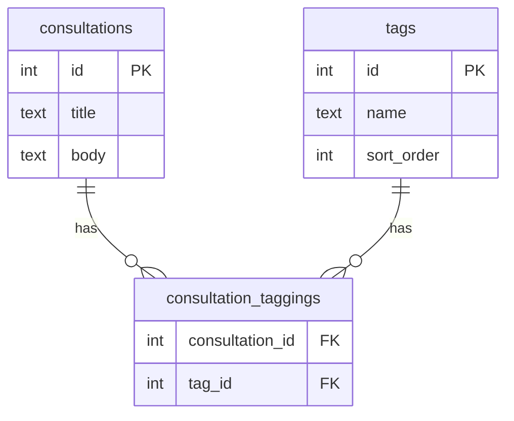

# [ADR] タグ機能のデータモデル・API・バリデーション設計

* **Status**: Accepted
* **Date**: 2026-02-08
* **Context**:
  * 相談に対してタグを付与し、分類・ 検索性を向上させる機能を追加する。
  * タグの管理方式、データモデル、API設計、バリデーションルールについて設 計判断が必要となった。

---

## Decision 1: データモデル — 多対多 （M:N） + 中間テーブル

### 採用: tags テーブル + consultation_taggings 中間テーブル

1つの相談に複数のタグ、1つのタグに複数の相談が紐づく多対多の関係を、中間テーブルで表現する。

```sql
-- tags
CREATE TABLE tags (
  id INTEGER PRIMARY KEY AUTOINCREMENT,
  name TEXT NOT NULL UNIQUE,
  sort_order INTEGER NOT NULL DEFAULT 0,
  created_at INTEGER NOT NULL DEFAULT (cast(unixepoch('subsecond') * 1000 as integer))
);

-- consultation_taggings
CREATE TABLE consultation_taggings (
  consultation_id INTEGER NOT NULL REFERENCES consultations(id) ON DELETE CASCADE,
  tag_id INTEGER NOT NULL REFERENCES tags(id) ON DELETE CASCADE,
  PRIMARY KEY (consultation_id, tag_id)
);
```

### 理由

- 多対多は中間テーブルによる正規化が定石であり、データの整合性を保ちやすい
- `consultation_taggings` の複合主キーにより、同一相談への同一タグの重複付与を物理的に防止
- `ON DELETE CASCADE` により、相談やタグが削除された際に中間テーブルのレコードも自動で削除される



---

## Decision 2: タグ管理方式 — マスタ管理型

### 採用: 管理者がタグを事前定義し、ユーザーはその中から選択する

### 不採用: フリータグ型 / ハイブリッド型

### 理由

- **タグの乱立防止**: フリータグ型では「キャリア」「キャリア相談」「キャリアの悩み」のような類似タグが乱立し、分類の意味が薄れる
- **表記ゆれ防止**: 管理者が統一された表記でタグを登録することで、検索精度が保たれる
- **検索性の担保**: タグ数が管理された範囲に収まるため、タグによるフィルタリングが有効に機能する
- **運用負荷の軽減**: 不適切なタグの監視・削除が不要

---

## Decision 3: sort_order の目的

### 採用: 管理者がタグの表示順を制御するためのカラム

```typescript
// タグ一覧取得時
ORDER BY sort_order ASC, id ASC
```

### 理由

- 「よく使われるタグ」「おすすめタグ 」を上位に表示したい場合に、管理者が任意の順序を設定できる
- `ORDER BY sort_order ASC` で取得するだけでUIの並び順を制御可能であり、フロント側に並び替えロジックが不要
- マスタ管理型では管理者が意図的に並び順を決めるケースが多く、`created_at` 順やアルファベット順では対応できない
- `sort_order` が同値の場合は `id ASC` をフォールバックとし、順序の安定性を保証する

---

## Decision 4: タグ付与ルール

### 採用: 相談作成時にタグを付与。1相談あたり上限3個

- 相談作成時にタグを選択して付与する
- 作成後のタグの追加・変更は不可（ニーズが出たら対応する）
- タグの付与は相談の投稿者が行う（管理者はタグの定義を行う）

### タグ付与数: 1個以上必須、上限3個

- 相談作成時に最低1個のタグ選択を必須とする
- 0個（タグなし）を許容すると、タグ検索で見つけられない相談が発生し、タグ機能が形骸化するリスクがある
- 「その他」のような汎用タグをマスタデータに含めることで、どの相談でも最低1個は選べる状態を担保する

### 上限3個の根拠

- **検索精度の向上**: タグが少ないほど、各タグの意味が明確になり、検索結果のノイズが減る
- **投稿者の選択精度**: 上限が少ないことで「本当に適切なタグはどれか」を考える動機になり、タグの品質が上がる
- **UIの安定性**: 3個ならモバイルでも1行に収まりやすく、カード型UIのレイアウトが崩れにくい
- **相談の性質**: 技術記事と異なり、相談のカテゴリ分けには「ジャンル」「対象」「状況」程度の2〜3軸で十分
- **拡張容易性**: 後から5個に緩和するのは容易だが、5個から3個に制限するのは既存データへの影響がある

---

## Decision 5: API設計

### 採用: `GET /api/tags` — タグ一覧 取得

```typescript
// レスポンス例
{
  "data": [
    { "id": 1, "name": "キャリア", "sort_order": 1, "count": 12 },
    { "id": 2, "name": "人間関係", "sort_order": 2, "count": 8 },
    { "id": 3, "name": "技術", "sort_order": 3, "count": 5 }
  ]
}
```

- `count`: そのタグが付与されている**公開済み相談**の件数。検索UIで「キャリア（12件）」のように件数を表示するために使用する
- `GROUP BY` + `COUNT` で中間テーブルを集計して算出する
- 下書き（`draft=true`）および非表示 （`hidden_at IS NOT NULL`）の相談はカウント対象外とする

### ページネーション不要の理由

- マスタ管理型のため、タグ数は管理者がコントロールする範囲に収まる（想定: 数十件程度）
- 全件取得しても数KB程度のレスポンスサイズであり、パフォーマンス上の問題はない

### キャッシュ

- 現時点では実装しない
- 将来的にパフォーマンスが気になったタイミングで `Cache-Control` ヘッダーによるキャッシュを導入する

---

## Decision 6: バリデーション

### タグ名の最大文字数: 20文字

- 日本語タグで最も長いケース（例:「ワークライフバランス」10文字）でも余裕がある
- 20文字を超えるとタグではなく文章になってしまい、タグとしての視認性・機能性が低下する
- UIのタグバッジ内に収まるサイズを考慮（20文字以内であればモバイルでも1行に収まる）

### 重複の扱い

- `UNIQUE` 制約で物理的に重複を防止する
- マスタ管理型のため、管理者が登録時に表記を統一する運用とする
- 大文字・小文字の正規化（例: `React` と `react` の同一視）はアプリ側では行わない。管理者が適切な表記で登録する責務を持つ

### 禁止文字

- マスタ管理型のため管理者が入力を制御するが、バリデーションとして以下を不可とする：
  - 空文字
  - 空白のみの文字列
  - 前後の空白（トリム処理）

---

## Decision 7: タグによる相談検索

### 採用: 単一タグでの検索を既存の相談一覧APIにフィルタとして追加

```
GET /api/consultations?tag=1&page=1&limit=20
```

- 既存の `userId`, `draft`, `solved` フィルタと同列にタグフィルタを追加する
- 最初は**単一タグでの検索のみ**サポートする（AND検索・OR検索は複雑化するため後回し）

### 不採用（現時点）: 複数タグでの検索

```
OR:  GET /api/consultations?tags=1,2       （いずれかのタグを含む）
AND: GET /api/consultations?tags=1,2&match=all （すべてのタグを含む）
```

- AND検索はクエリが複雑化し、パフォーマンスへの影響も大きい
- ニーズが顕在化してから拡張する

### インデックス

中間テーブルの複合主キー `(consultation_id, tag_id)` は「相談 → タグ」方向の検索には有効だが、「タグ → 相談」方向には効きにくい。
タグによる相談検索がメイン用途であるため、`tag_id` 側のインデックスを追加する。

```sql
CREATE INDEX idx_consultation_taggings_tag_id ON consultation_taggings (tag_id);
```

---

## Summary

| 項目 | 決定内容 | 理由 |
|------|---------|------|
| **データモデル** | M:N + 中間テーブル + `tag_id` インデックス | 正規化によるデータ整合性の担保。タグ検索のパフォーマンス確保 |
| **管理方式** | マスタ管理型 | タグ 乱立・表記ゆれ防止、検索性の担保 |
| **sort_order** | 管理者による表示順制御 | 意図的な並び順設定のため |
| **タグ付与** | 作成時のみ、1〜3個必須 | 検索精度、投稿者の選択精度、UI安定性、拡張容易性 |
| **API** | `GET /api/tags`（件数付き、ページネーションなし） | マスタデータで件数が限定的。検索UIで件数表示に利用 |
| **タグ検索** | 単一タグでの検索（既存APIにフィルタ追加） | シンプルに始め、AND/OR検索は必要時に拡張 |
| **タグ名上限** | 20文字 | 視認性・UI収まり・機能性の観点 |
| **重複防止** | UNIQUE制約 + 管理者 運用 | マスタ管理型に適した方式 |