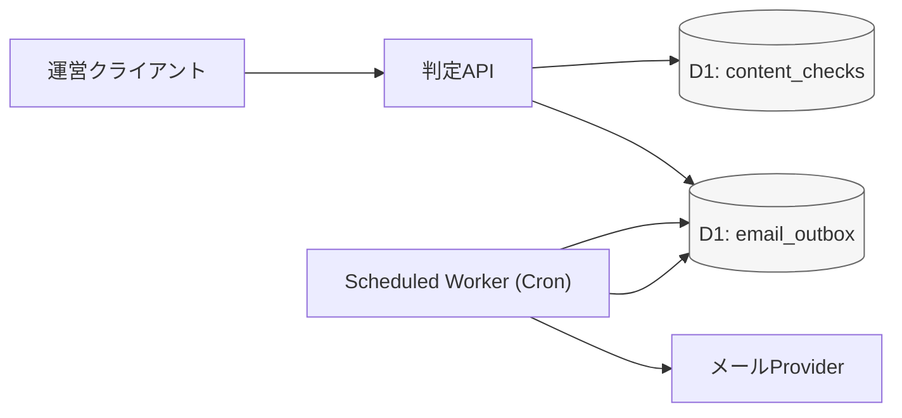
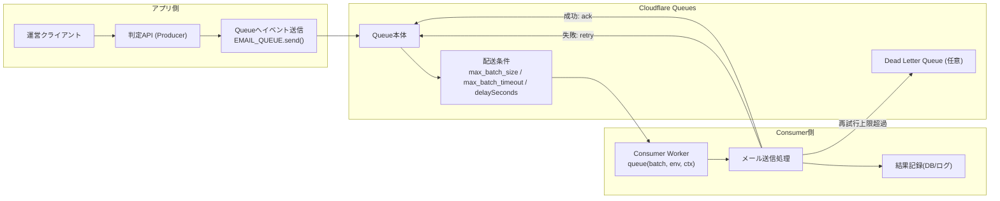
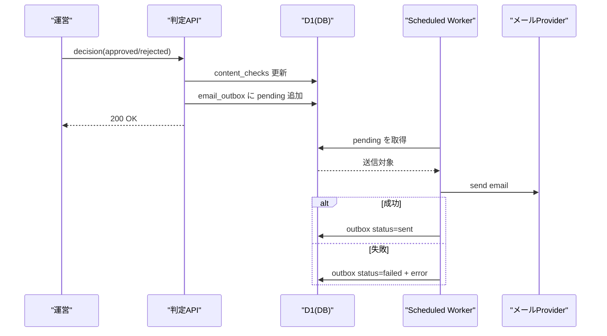
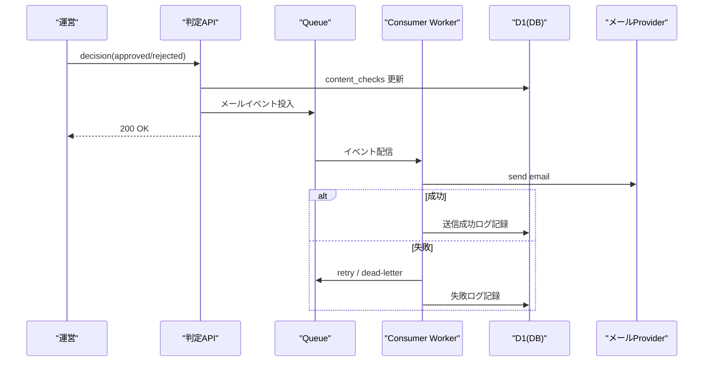
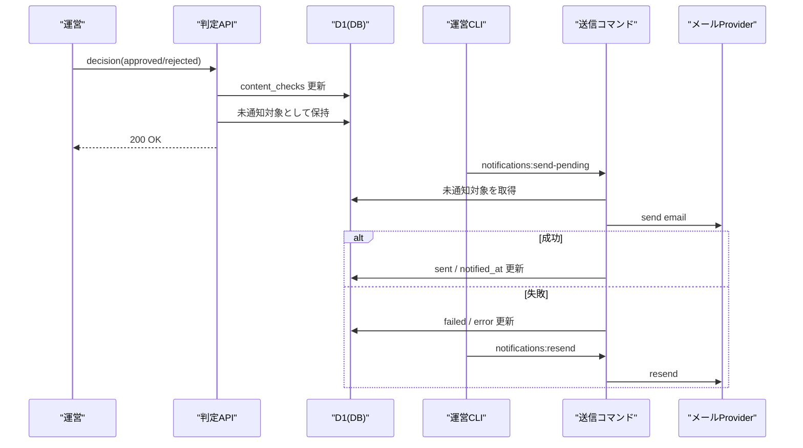
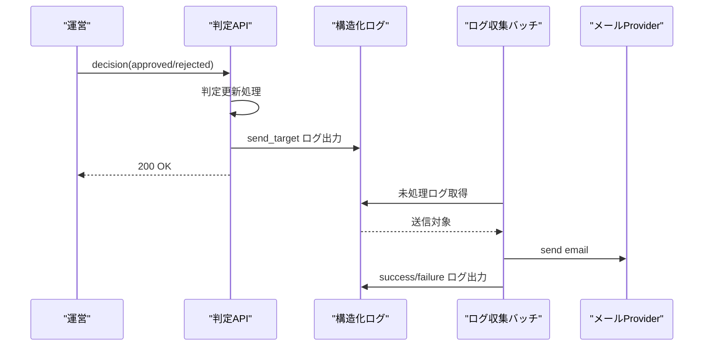
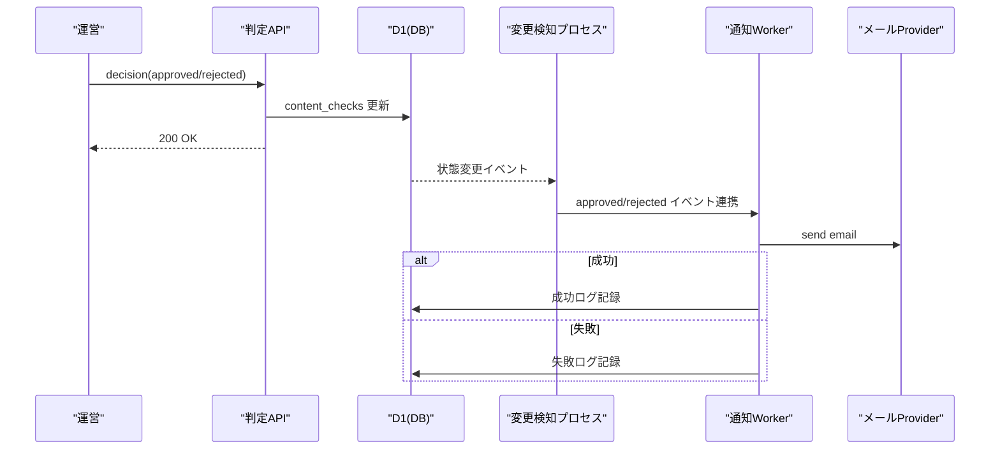

# RFC: Email Technology Selection

- Status: Draft
- Created: 2026-04-05
- Owner: kazuki

## 1. Background

(これまでのメール技術選定に関する背景を記載)
運営が相談やアドバイスを審査し承認した場合に、ユーザーに通知する必要がある。その際に、メールで知らせることを目的としている。そのための技術選定が必要。

## 2. Goals / Non-Goals

### Goals
- 投稿チェックで `approved` または `rejected` になったタイミングで、投稿者へメール通知する。
- MVPとして小さく導入し、将来の再送強化や自動化に拡張しやすい形にする。

### Non-Goals
- 重複送信の完全排除（idempotency key導入はMVP対象外）

## 3. Requirements

- Functional requirements:
  - `approved` / `rejected` の両方で投稿者へメール通知する。
  - 承認APIでメールを直接送信しない（判定処理と通知処理を分離する）。
  - 送信失敗時に手動再送できる。
- Non-functional requirements:
  - `fail-open`（判定結果の更新は通知失敗に影響させない。C案では通知は後続コマンドで回復する前提）。
  - 承認APIの遅延・タイムアウトを最小化する。
  - 失敗理由を `temporary` / `config` で判別できるログを残す。

## 4. Options Considered

### 前提方針（なぜ承認APIから直接送らないか）

- 前提として、承認APIからメール送信は行わない方針とする。
- 理由:
  - 承認API全体が遅延・タイムアウトしやすくなるため（外部メールAPI待ちが発生する）。
  - メール障害が発生した際に、承認失敗なのか通知失敗なのかを切り分けづらくなるため。
  - 承認APIの責務（判定更新）と通知責務（配信）を分離し、保守しやすくするため。
  - `fail-open` を成立させ、通知障害時でも運営の判定オペレーションを止めないため。
  - 将来の再送自動化や通知チャネル追加に備えて、送信基盤を独立させたいから。

### 検討案（承認APIでメールを直接送信しない前提）

1. パターンA: Outboxテーブル + Scheduled Worker（DBポーリング）
- 仕組み:
  - 判定APIは `email_outbox` に「送信予定」を保存するだけ。
  - Scheduled Worker（Cron）が未送信レコードを定期取得して送信。
- 説明用メモ:
  - 仕組みはシンプルで2段階。
  - 1段階目: 判定APIはメールを送らず、`email_outbox` に送信予約レコードだけを保存する。
  - 2段階目: 定期実行Worker（Cron）が `pending` を拾って送信し、結果を `sent/failed` に更新する。
  - つまり「APIは予約だけ、送信は後段の定期ジョブ」という分離方式。

- コスト方針（MVP）:
  - MVPではコスト最適化を優先し、メール送信は定期バッチで実行する。
  - 実行間隔は1時間・3時間・6時間を候補。
  - 1時間は通知体験が良い一方で実行回数が増える。
  - 6時間は最も低コストだが通知が遅くなる。
  - 3時間は通知速度とコストのバランス案として検討余地がある。
  - 最終的な実行間隔は、運用データ（通知件数・問い合わせ件数・失敗率）を見て決定する。

- メリット:
  - 実装: 既存DB中心で構成でき、導入コストが低い。
  - 運用: 送信状態をテーブルで追跡しやすく、手動再送がしやすい。
  - 拡張: 後からQueue方式に段階移行しやすい。

- デメリット:
  - 性能: Cron間隔ぶん、通知遅延が発生しやすい。
  - 運用: ポーリング時の重複取得・同時実行制御が必要。
  - スケール: 件数増加時にDB負荷が上がりやすい。

- 比較メモ（主にB案との比較）:
  - コスト: Queueのoperation課金はない一方、D1のread/writeとCron実行回数が主なコスト要因になる。
  - ランニング費: 件数が少ないMVP段階では小さくなりやすいが、ポーリング間隔を短くするとreadコストが増えやすい。
  - 運用: outboxテーブルの滞留監視、失敗レコード再送、定期実行の停止検知を運用に含める必要がある。

2. パターンB: Queue Producer/Consumer
- 仕組み:
  - 判定APIはメールイベントをQueueへ投入。
  - Consumerが非同期に送信し、失敗時リトライを処理。
- 実装イメージ:
  - Cloudflare Queues がメッセージを保持する。
  - Cloudflare が Consumer Worker を起動する。
  - 起動された Worker 内で、実装した `queue handler` が実行される。

- コスト参考（公式 pricing ページ参照）:
  - Queuesの課金単位は operation（write/read/delete）。
  - 1メッセージ処理あたり、概ね `write + read + delete` の3 operationが基準。
  - retry発生時はreadが追加され、DLQ退避時はwriteが追加される。
  - Free/Paidの最新単価・無料枠は、導入時点で公式 pricing を再確認する前提とする。
- 公式参照:
  - https://developers.cloudflare.com/queues/
  - https://developers.cloudflare.com/queues/configuration/configure-queues/
  - https://developers.cloudflare.com/queues/configuration/javascript-apis/
  - https://developers.cloudflare.com/queues/configuration/batching-retries/
  - https://developers.cloudflare.com/queues/platform/pricing/
- メリット:
  - 性能: 低遅延で配信しやすく、API応答も安定しやすい。
  - スケール: 通知件数増加に追随しやすい。
  - 信頼性: リトライ制御を設計しやすい。
- デメリット:
  - 実装: MVP初期には導入コストがAより高い。
  - 運用: キュー監視・失敗メッセージ運用の負荷が増える。
  - 調査: 非同期分散により障害調査導線が複雑化しやすい。

- 比較メモ（主にA案との比較）:
  - 導入コスト: ランニング費用差より、Producer/Consumer設定、再試行、DLQ、監視導線の実装工数が主因。
  - 工数目安: Aに対してBは1.5〜2倍程度の実装工数になる可能性がある（チーム習熟度で変動）。
  - ランニング費: MVP規模ではQueuesの費用は小さく収まりやすく、差分は主に開発/運用コストとして現れる。

3. パターンC: 実行コマンド方式（手動バッチ送信）
- 仕組み:
  - 承認APIは `approved/rejected` の更新のみ行う（通知は実行しない）。
  - 未通知対象を基準に、運営が実行コマンドで送信を実行する。
  - 失敗時はログ記録し、再送コマンドで個別またはまとめて再送する。
- メリット:
  - 実装: API責務を分離しつつ、Queue導入なしで始められる。
  - 変更範囲: 既存構成への影響が少ない。
  - 制御: 運営判断で送信タイミングと再送を制御できる。
- デメリット:
  - 運用: コマンド実行漏れで通知遅延・未送信が発生しやすい。
  - 品質: 人手運用のため、再現性やSLAが不安定になりやすい。
  - スケール: 通知件数増加時に手動運用がボトルネックになりやすい。

- 推奨実装（MVP案）:
  - `send-pending` コマンド: 未通知対象をまとめて送信する（例: `pnpm notifications:send-pending --limit 100`）。
  - `resend` コマンド: 失敗対象を個別再送する（例: `pnpm notifications:resend --target-type consultation --target-id 123 --decision approved`）。
  - 運用手順: 「判定API実行 -> send-pending実行 -> failures確認 -> resend実行」をRunbook化する。
  - 送信管理データ: MVPでは `content_checks` に送信管理カラムを追加する案を採用候補とする。
    - 例: `notified_at`（送信成功時刻）, `notify_last_error`（直近失敗理由）
    - 未送信判定例: `status IN ('approved', 'rejected') AND notified_at IS NULL`
- 運用（暫定案）:
  - 実行主体: 運営メンバー
  - 実行タイミング: 夜間の運営作業タイミングで実行
  - 実行頻度: 1日1〜5回を候補として運用し、通知件数・問い合わせ件数・失敗率を見て調整する
  - 日次の最低フロー: その日の判定作業終了後に `send-pending` を1回実行し、失敗があれば `resend` を実行する

- 比較メモ（A/Bとの比較例）:
  - A案比: 自動実行基盤が不要な分、導入は軽いが、送信自動性は下がる。
  - B案比: Queue導入コストは抑えられるが、遅延/人依存リスクは相対的に高い。
  - 工数感: 初期実装は小さいが、件数増加時はA/Bへの移行検討が必要になりやすい。
- データモデル補足（MVPで `content_checks` に寄せる理由）:
  - MVP段階では実装速度と変更範囲を優先し、テーブル分割よりも既存テーブル拡張のほうが導入しやすい。
  - ただし、通知履歴の複数保持や監査要件が強くなった場合は `email_outbox` / `notification_deliveries` などの別テーブル分離を検討する。

## 5. Decision

## 6. Trade-offs

## 7. Migration / Rollout Plan

## 8. Open Questions

## 9. Implementation Patterns (MVP Draft)

### 9.1 パターンA: Outboxテーブル + Scheduled Worker（DBポーリング）

- 判定APIで `content_checks` 更新後、`email_outbox` に送信予定レコードを追加
- レコードに `target_type / target_id / decision / to_email / template_type / status(pending)` を保存
- Scheduled Worker（Cron）が `pending` を定期取得して送信
- 成功時は `status=sent`、失敗時は `status=failed` と `error_type/error_message` を更新
- 手動再送コマンドで `failed` を再送し、成功時に `sent` へ更新

### 9.2 パターンB: Queue Producer/Consumer

- 判定APIで `content_checks` 更新後、メールイベントをQueueへ投入
- イベントに `target_type / target_id / decision / to_email / template_type` を含める
- Consumer Workerがイベント受信してメール送信
- 成功時はACK、失敗時はリトライ（上限超過時は失敗扱い）
- 手動再送コマンドは失敗イベントを再投入

### 9.3 パターンC: 実行コマンド方式（手動バッチ送信）

- 判定APIでは `approved/rejected` 更新のみ行う（通知処理は実行しない）
  - 運営コマンド（例: `pnpm notifications:send-pending --limit 100`）で未通知対象を取得して送信
- 失敗対象は `pnpm notifications:resend ...` で再送
- 送信結果はログ（または失敗管理テーブル）に記録する

### 9.4 参考案: ログ駆動バッチ方式

- 判定API後に送信対象情報を構造化ログへ出力
- 定期バッチがログを読み、未送信対象を抽出して送信
- 送信結果を別ログ（成功/失敗）で記録
- 手動再送コマンドは `target_type/target_id` 指定で個別再送

### 9.5 参考案: CDC/変更検知連携

- `content_checks` の `approved/rejected` 更新を変更イベントとして検知
- 変更イベントから通知対象（投稿者メール、テンプレ種別）を解決
- 別プロセスがメール送信を実行
- 成功/失敗をイベント処理ログに記録
- 手動再送コマンドは失敗イベントID指定で再処理

