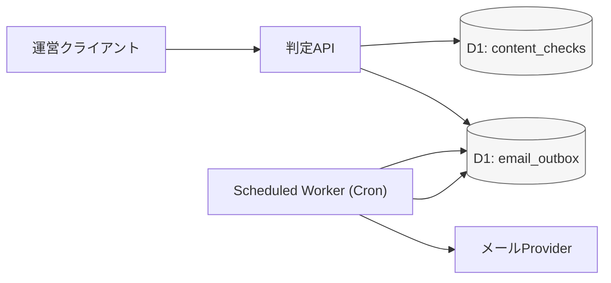
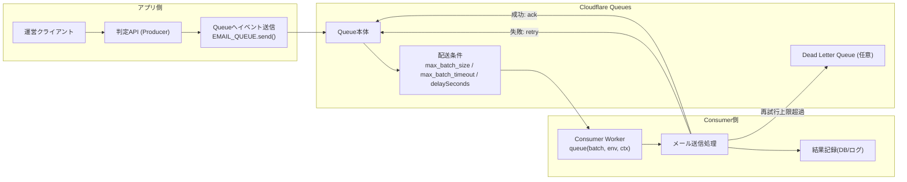

# RFC: Email Technology Selection

- Status: Draft
- Created: 2026-04-05
- Owner: kazuki

## 1. Background

(これまでのメール技術選定に関する背景を記載)
運営が相談やアドバイスを審査し承認した場合に、ユーザーに通知する必要がある。その際に、メールで知らせることを目的としている。そのための技術選定が必要。

## 2. Goals / Non-Goals

### Goals
- 投稿チェックで `approved` または `rejected` になったタイミングで、投稿者へメール通知する。
- MVPとして小さく導入し、将来の再送強化や自動化に拡張しやすい形にする。

### Non-Goals
- 重複送信の完全排除（idempotency key導入はMVP対象外）

## 3. Requirements

- Functional requirements:
  - `approved` / `rejected` の両方で投稿者へメール通知する。
  - 承認APIでメールを直接送信しない（判定処理と通知処理を分離する）。
  - 送信失敗時に手動再送できる。
- Non-functional requirements:
  - `fail-open`（判定結果の更新は通知失敗に影響させない。C案では通知は後続コマンドで回復する前提）。
  - 承認APIの遅延・タイムアウトを最小化する。
  - 失敗理由を `temporary` / `config` で判別できるログを残す。

## 4. Options Considered

### 前提方針（なぜ承認APIから直接送らないか）

- 前提として、承認APIからメール送信は行わない方針とする。
- 理由:
  - 承認API全体が遅延・タイムアウトしやすくなるため（外部メールAPI待ちが発生する）。
  - メール障害が発生した際に、承認失敗なのか通知失敗なのかを切り分けづらくなるため。
  - 承認APIの責務（判定更新）と通知責務（配信）を分離し、保守しやすくするため。
  - `fail-open` を成立させ、通知障害時でも運営の判定オペレーションを止めないため。
  - 将来の再送自動化や通知チャネル追加に備えて、送信基盤を独立させたいから。

### 検討案（承認APIでメールを直接送信しない前提）

1. パターンA: Outboxテーブル + Scheduled Worker（DBポーリング）
- 仕組み:
  - 判定APIは `email_outbox` に「送信予定」を保存するだけ。
  - Scheduled Worker（Cron）が未送信レコードを定期取得して送信。
- 説明用メモ:
  - 仕組みはシンプルで2段階。
  - 1段階目: 判定APIはメールを送らず、`email_outbox` に送信予約レコードだけを保存する。
  - 2段階目: 定期実行Worker（Cron）が `pending` を拾って送信し、結果を `sent/failed` に更新する。
  - つまり「APIは予約だけ、送信は後段の定期ジョブ」という分離方式。

- コスト方針（MVP）:
  - MVPではコスト最適化を優先し、メール送信は定期バッチで実行する。
  - 実行間隔は1時間・3時間・6時間を候補。
  - 1時間は通知体験が良い一方で実行回数が増える。
  - 6時間は最も低コストだが通知が遅くなる。
  - 3時間は通知速度とコストのバランス案として検討余地がある。
  - 最終的な実行間隔は、運用データ（通知件数・問い合わせ件数・失敗率）を見て決定する。

- メリット:
  - 実装: 既存DB中心で構成でき、導入コストが低い。
  - 運用: 送信状態をテーブルで追跡しやすく、手動再送がしやすい。
  - 拡張: 後からQueue方式に段階移行しやすい。

- デメリット:
  - 性能: Cron間隔ぶん、通知遅延が発生しやすい。
  - 運用: ポーリング時の重複取得・同時実行制御が必要。
  - スケール: 件数増加時にDB負荷が上がりやすい。

- 比較メモ（主にB案との比較）:
  - コスト: Queueのoperation課金はない一方、D1のread/writeとCron実行回数が主なコスト要因になる。
  - ランニング費: 件数が少ないMVP段階では小さくなりやすいが、ポーリング間隔を短くするとreadコストが増えやすい。
  - 運用: outboxテーブルの滞留監視、失敗レコード再送、定期実行の停止検知を運用に含める必要がある。

2. パターンB: Queue Producer/Consumer
- 仕組み:
  - 判定APIはメールイベントをQueueへ投入。
  - Consumerが非同期に送信し、失敗時リトライを処理。
- 実装イメージ:
  - Cloudflare Queues がメッセージを保持する。
  - Cloudflare が Consumer Worker を起動する。
  - 起動された Worker 内で、実装した `queue handler` が実行される。

- コスト参考（公式 pricing ページ参照）:
  - Queuesの課金単位は operation（write/read/delete）。
  - 1メッセージ処理あたり、概ね `write + read + delete` の3 operationが基準。
  - retry発生時はreadが追加され、DLQ退避時はwriteが追加される。
  - Free/Paidの最新単価・無料枠は、導入時点で公式 pricing を再確認する前提とする。
- 公式参照:
  - https://developers.cloudflare.com/queues/
  - https://developers.cloudflare.com/queues/configuration/configure-queues/
  - https://developers.cloudflare.com/queues/configuration/javascript-apis/
  - https://developers.cloudflare.com/queues/configuration/batching-retries/
  - https://developers.cloudflare.com/queues/platform/pricing/
- メリット:
  - 性能: 低遅延で配信しやすく、API応答も安定しやすい。
  - スケール: 通知件数増加に追随しやすい。
  - 信頼性: リトライ制御を設計しやすい。
- デメリット:
  - 実装: MVP初期には導入コストがAより高い。
  - 運用: キュー監視・失敗メッセージ運用の負荷が増える。
  - 調査: 非同期分散により障害調査導線が複雑化しやすい。

- 比較メモ（主にA案との比較）:
  - 導入コスト: ランニング費用差より、Producer/Consumer設定、再試行、DLQ、監視導線の実装工数が主因。
  - 工数目安: Aに対してBは1.5〜2倍程度の実装工数になる可能性がある（チーム習熟度で変動）。
  - ランニング費: MVP規模ではQueuesの費用は小さく収まりやすく、差分は主に開発/運用コストとして現れる。

3. パターンC: 実行コマンド方式（手動バッチ送信）
- 仕組み:
  - 承認APIは `approved/rejected` の更新のみ行う（通知は実行しない）。
  - 未通知対象を基準に、運営が実行コマンドで送信を実行する。
  - 失敗時はログ記録し、再送コマンドで個別またはまとめて再送する。
  - 承認作業をしたら、そのセットとして必ずメール送信コマンドも叩く
- メリット:
  - 実装: API責務を分離しつつ、Queue導入なしで始められる。
  - 変更範囲: 既存構成への影響が少ない。
  - 制御: 運営判断で送信タイミングと再送を制御できる。
- デメリット:
  - 運用: コマンド実行漏れで通知遅延・未送信が発生しやすい。
  - 品質: 人手運用のため、再現性やSLAが不安定になりやすい。
  - スケール: 通知件数増加時に手動運用がボトルネックになりやすい。

- 推奨実装（MVP案）:
  - `send-pending` コマンド: 未通知対象をまとめて送信する（例: `pnpm notifications:send-pending --limit 100`）。
  - `resend` コマンド: 失敗対象を個別再送する（例: `pnpm notifications:resend --target-type consultation --target-id 123 --decision approved`）。
  - 運用手順: 「判定API実行 -> send-pending実行 -> failures確認 -> resend実行」をRunbook化する。
  - 送信管理データ: MVPでは `content_checks` に送信管理カラムを追加する案を採用候補とする。
    - 例: `notified_at`（送信成功時刻）, `notify_last_error`（直近失敗理由）
    - 未送信判定例: `status IN ('approved', 'rejected') AND notified_at IS NULL`
- 運用（暫定案）:
  - 実行主体: 運営メンバー
  - 実行タイミング: 夜間の運営作業タイミングで実行
  - 実行頻度: 1日1〜5回を候補として運用し、通知件数・問い合わせ件数・失敗率を見て調整する
  - 日次の最低フロー: その日の判定作業終了後に `send-pending` を1回実行し、失敗があれば `resend` を実行する

- 比較メモ（A/Bとの比較例）:
  - A案比: 自動実行基盤が不要な分、導入は軽いが、送信自動性は下がる。
  - B案比: Queue導入コストは抑えられるが、遅延/人依存リスクは相対的に高い。
  - 工数感: 初期実装は小さいが、件数増加時はA/Bへの移行検討が必要になりやすい。
- データモデル補足（MVPで `content_checks` に寄せる理由）:
  - MVP段階では実装速度と変更範囲を優先し、テーブル分割よりも既存テーブル拡張のほうが導入しやすい。
  - ただし、通知履歴の複数保持や監査要件が強くなった場合は `email_outbox` / `notification_deliveries` などの別テーブル分離を検討する。

## 5. Mail Library Selection (Draft)

### 5.1 この項目で決めること

- 送信方式: HTTP API / SMTP のどちらを採用するか
- 採用候補: Resend / SendGrid / AWS SES のうちMVPで採用するもの
- 実装責務: `MailClient` インターフェースでプロバイダ依存を分離するか
- 必須機能: タイムアウト、エラー分類（`temporary/config`）、ログ連携
- テンプレート: `approved/rejected` 固定文面の管理方法
- 設定管理: APIキー/送信元/環境別設定の管理方法
- コスト評価: MVP時点で「ランニング費」と「導入/運用工数」のどちらを重視するか

### 5.2 送信方式比較（HTTP API vs SMTP）

- HTTP API:
  - 利点: Workers環境で `fetch` 実装しやすい、エラー分類しやすい、ログ連携しやすい
  - 懸念: プロバイダごとのAPI差分を吸収する設計が必要
- SMTP:
  - 利点: 汎用方式で、環境によっては移行しやすい
  - 懸念: Workers環境での運用制約確認が必要、エラー分類が複雑化しやすい
  - 補足（公式制約）: Workersのoutbound TCPはport 25接続が禁止されているため、SMTP直送構成に制約がある
    - 参考: https://developers.cloudflare.com/workers/runtime-apis/tcp-sockets/
  - 補足（理由）: port 25はスパム送信の悪用経路になりやすく、多くの環境で制限対象となる
    - 参考: https://www.cloudflare.com/learning/email-security/smtp-port-25-587/
  - MVPでの扱い:
    - SMTPの代表ポート（25/587/465）は存在するが、今回はSMTP方式自体を採用しない。
    - port 25はWorkers制約で利用不可。
    - port 587/465は技術的には候補だが、SMTP接続/暗号化/エラー処理の運用設計が追加で必要になり、MVPの実装・運用コストが増える。
    - そのためMVPではHTTP API方式を採用。
- 現時点の暫定判断:
  - Workers実行環境との相性から HTTP API を第一候補とする

### 5.3 候補比較（5.1の観点に基づく）

### 5.3.1 Resend

- 技術的特徴:
  - HTTP APIベースで完結（SMTP不要）
  - Cloudflare Workers / Edge環境と相性が良い
  - TypeScriptファースト（SDKがシンプル）
  - React Emailなどテンプレートとの親和性が高い
  - Webhookでイベント駆動（delivery / open / click）
  - 構成がシンプルで学習コストが低い
  - `MailClient` 抽象化に組み込みやすい
  - エラーハンドリングが比較的単純（APIレスポンス中心）
  - ドメイン認証（SPF/DKIM）は必要だが比較的シンプル
- 既存スタックとの親和性:
  - Cloudflare Workers + C案（手動コマンド）と組み合わせやすい
  - `fetch` ベースで実装でき、既存のHono/Workers構成に馴染みやすい
- 障害リスク:
  - プロバイダ障害時は送信失敗が発生しうる（他候補と同様）
  - MVPでは単純構成のため、アプリ側の実装由来障害は相対的に抑えやすい
- 障害調査:
  - APIレスポンス中心で失敗判定しやすく、`temporary/config` 分類へ落とし込みやすい
  - Webhookやログとの突合で調査導線を作りやすい
- コスト観点:
  - 無料枠あり（Free: `3,000通/月`、`100通/日`）。
  - 有料例（Pro）: `\$20/月で50,000通`、超過 `\$0.90 / 1,000通`。
  - 従量課金で見積もりしやすく、MVP段階では開発工数込みでコスト最適になりやすい。
  - SendGridと同等〜やや安価レンジ想定、SESよりは高い想定。
  - 参考: https://resend.com/pricing
- 現時点の位置づけ:
  - 優先候補

### 5.3.2 SendGrid

- 技術的特徴:
  - HTTP API + SMTP両対応
  - トランザクションメール + マーケティングメール対応
  - 分析機能（開封率・クリック率）
  - Webhookでイベント処理可能
  - エラーコード体系が整っている（分類しやすい）
  - 専用IPやIPウォームアップなどの運用機能がある
  - ダッシュボードは多機能（機能学習コストは上がりやすい）
- 既存スタックとの親和性:
  - HTTP APIで実装可能なため、Workers構成との接続は可能
  - ただし機能が多く、MVPでは使わない設定項目が増えやすい
- 障害リスク:
  - 機能/設定が豊富な分、初期設定ミスの余地が増える
  - 高機能ゆえに運用フローが複雑化し、運用ミスリスクが上がる可能性
- 障害調査:
  - イベント/ログ機能が豊富で調査可能性は高い
  - 反面、調査ポイントが多く運用に慣れるまで時間がかかる
- コスト観点:
  - Free trialは `100通/日`（60日）。
  - 有料例: Essentials `\$19.95〜`、Pro `\$89.95〜`（プラン/条件で変動）。
  - overageは発生し得るが、実額は契約条件依存で確認が必要。
  - Resendよりやや高め、SESよりは高い想定。
  - 機能込みの総合コスパは高いが、MVPではオーバースペックになりやすい。
  - 参考:
    - https://sendgrid.com/en-us/pricing
    - https://www.twilio.com/en-us/pricing/current-rates
    - https://support.sendgrid.com/hc/en-us/articles/40779261694875-Twilio-SendGrid-Overage-Rates
- 現時点の位置づけ:
  - 優先候補

### 5.3.3 AWS SES

- 技術的特徴:
  - HTTP API + SMTP両対応
  - AWS SDKで操作可能
  - 高いスケーラビリティ
  - SQS / Lambda / SNS 連携が可能（イベント駆動設計に向く）
  - Deliverabilityは設定次第で高水準を狙える
  - ドメイン認証（SPF/DKIM/DMARC）が必要
  - Sandbox制限があり、本番利用前に解除手続きが必要
  - ログ・再送・監視などは自前設計の比重が高い
  - GUIやマーケ機能は比較的少なく、インフラ寄り
- 既存スタックとの親和性:
  - 技術的には連携可能だが、現行でAWS主軸運用でない点は不利
  - 導入時にAWS側の設定/運用知識が必要になりやすい
- 障害リスク:
  - Sandbox/認証/設定周りの初期運用でつまずくリスクがある
  - 本番運用までの導線設計を誤ると配信遅延・未送信リスクが増える
- 障害調査:
  - 調査は可能だが、AWSサービス横断の観点が必要になりやすい
  - AWS未主軸チームでは、初期の調査コストが相対的に高くなる可能性
- コスト観点:
  - 従量課金の単価は業界内で低め
  - 目安として `$0.10 / 1,000通` クラス
  - Free Tier（条件付き）で `3,000 message charges/月` の記載あり
  - 大量送信時のコスト優位性が高い
  - 初期構築・運用の人的コストは相対的に高い
  - AWS前提でない場合、学習/運用コスト込みで割高になりやすい
  - 参考: https://aws.amazon.com/ses/pricing/
- 現時点の位置づけ:
  - 優先度を下げる候補
- 再検討トリガー:
  - 送信件数増加
  - 配信要件の厳格化
  - C案からA/B案へ移行するタイミング
