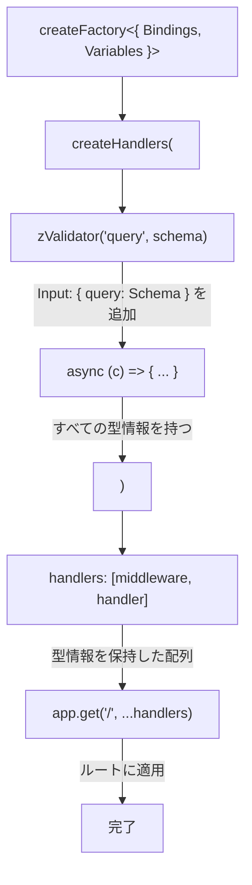

# Hono createHandlers 解説

## 📌 概要

`createHandlers`は、Honoの`createFactory`ヘルパーが提供するメソッドで、**型安全なハンドラ配列を生成**します。

---

## 🔍 createHandlersとは

### 基本的な役割

```typescript
import { createFactory } from "hono/factory";

// 1. ファクトリを作成（型情報を設定）
const factory = createFactory<{ Bindings: Env; Variables: Variables }>();

// 2. createHandlersでハンドラ配列を生成
const handlers = factory.createHandlers(
  middleware1,
  middleware2,
  async (c) => {
    // 最終ハンドラ
    return c.json({ data: [] });
  }
);

// 3. スプレッド構文でルートに適用
app.get("/path", ...handlers);
```

### 内部動作（シンプル！）

`createHandlers`の内部実装は驚くほどシンプルです：

```typescript
// 実際のHonoのソースコード（簡略化）
createHandlers(...handlers) {
  return handlers;  // そのまま返すだけ！
}
```

**えっ、それだけ？** はい、それだけです。

---

## 🎯 なぜcreateHandlersが必要なのか

### 問題：素の関数では型推論が効かない

```typescript
// ❌ 型推論が効かない
async function myHandler(c: Context) {
  const query = c.req.valid("query");  // 型エラー！
  const db = c.get("db");              // 型エラー！
}

app.get("/", zValidator("query", schema), myHandler);
```

TypeScriptは、`myHandler`が`zValidator`の後に実行されることを知らないため、型推論ができません。

### 解決：createHandlersで型情報を保持

```typescript
// ✅ 型推論が効く
const handlers = factory.createHandlers(
  zValidator("query", schema),
  async (c) => {
    const query = c.req.valid("query");  // 型推論OK！
    const db = c.get("db");              // 型推論OK！
  }
);

app.get("/", ...handlers);
```

`createHandlers`は、**ミドルウェアチェーン全体を1つの単位として型付け**するため、後続のハンドラでも型情報が保持されます。

---

## 📊 型推論の仕組み

### ステップ1: createFactoryで基本型を設定

```typescript
const factory = createFactory<{
  Bindings: Env;      // 環境変数（DB接続など）
  Variables: Variables; // コンテキスト変数（auth情報など）
}>();
```

### ステップ2: createHandlersで型を積み上げ

```typescript
const handlers = factory.createHandlers(
  // ミドルウェア1: zValidatorがクエリの型を追加
  zValidator("query", listConsultationsQuerySchema),
  
  // ハンドラ: 上記すべての型情報を持つ
  async (c) => {
    // c の型は以下を含む：
    // - Bindings: Env
    // - Variables: Variables
    // - Input: { query: ListConsultationsQuery }
    
    c.req.valid("query");  // ListConsultationsQuery型
    c.get("db");           // DbInstance型
    c.get("auth");         // AuthInstance型
  }
);
```

### 型の流れ（図解）



---

## 💡 createHandlersのメリット

### 1. 型安全性

```typescript
// コンパイル時にエラーを検出
const handlers = factory.createHandlers(
  async (c) => {
    const query = c.req.valid("query");  // ❌ エラー！zValidatorがない
  }
);
```

### 2. 再利用性

```typescript
// 複数ルートで同じハンドラを使える
app.get("/consultations", ...listConsultationsHandlers);
app.get("/api/v1/consultations", ...listConsultationsHandlers);
```

### 3. テスト容易性

```typescript
// ハンドラを単体でテストできる
import { listConsultationsHandlers } from "./consultations.controller";

describe("listConsultationsHandlers", () => {
  it("should return consultations", async () => {
    // ハンドラ配列にアクセス可能
    const [validator, handler] = listConsultationsHandlers;
    // ...
  });
});
```

### 4. ファイル分割

```typescript
// handlers/consultations.ts
export const listConsultationsHandlers = factory.createHandlers(...);

// routes/consultations.ts
import { listConsultationsHandlers } from "../handlers/consultations";
app.get("/", ...listConsultationsHandlers);
```

---

## 🔄 インラインハンドラとの比較

### インラインハンドラ

```typescript
app.get(
  "/",
  zValidator("query", schema),
  async (c) => {
    // 型推論OK（Honoが自動的に型を推論）
  }
);
```

**仕組み**: Honoの`get`メソッドがジェネリクスで型を積み上げる

### createHandlers

```typescript
const handlers = factory.createHandlers(
  zValidator("query", schema),
  async (c) => {
    // 型推論OK（createHandlersが型を積み上げる）
  }
);
app.get("/", ...handlers);
```

**仕組み**: `createHandlers`がジェネリクスで型を積み上げる

### 結論

どちらも**同じ型安全性**を提供しますが、`createHandlers`は**分離・再利用・テスト**が可能です。

---

## 📝 実装例（fumufumu）

```typescript
// consultations.controller.ts

import { Hono } from "hono";
import { createFactory } from "hono/factory";
import { zValidator } from "@hono/zod-validator";
import type { Env, Variables } from "@/index";

// ファクトリを作成
const factory = createFactory<{ Bindings: Env; Variables: Variables }>();

// 相談一覧取得ハンドラ
export const listConsultationsHandlers = factory.createHandlers(
  zValidator("query", listConsultationsQuerySchema),
  async (c) => {
    const query = c.req.valid("query");  // 型: { userId?, draft?, solved? }
    const db = c.get("db");              // 型: DbInstance
    // ...
  }
);

// ルーター
export const consultationsRoute = new Hono<{ Bindings: Env; Variables: Variables }>();
consultationsRoute.use("/*", authGuard);
consultationsRoute.get("/", ...listConsultationsHandlers);
```

---

## ❓ よくある質問

### Q1: createHandlersは必須？

**A**: いいえ。インラインハンドラでも同じことができます。ただし、ハンドラの再利用やテストが必要な場合は`createHandlers`が便利です。

### Q2: パフォーマンスへの影響は？

**A**: ありません。`createHandlers`は単に配列を返すだけなので、ランタイムのオーバーヘッドはほぼゼロです。

### Q3: 複数のミドルウェアを使える？

**A**: はい。いくつでも追加できます：

```typescript
const handlers = factory.createHandlers(
  middleware1,
  middleware2,
  middleware3,
  async (c) => { /* 最終ハンドラ */ }
);
```

### Q4: createMiddlewareとの違いは？

**A**: 
- `createMiddleware`: 単一のミドルウェアを型安全に作成
- `createHandlers`: ミドルウェア + ハンドラのセットを型安全に作成

---

## 📚 参考リンク

- [Hono - Factory Helper](https://hono.dev/docs/helpers/factory)
- [Hono - Best Practices](https://hono.dev/docs/guides/best-practices)
- [Hono - GitHub Source](https://github.com/honojs/hono/blob/main/src/helper/factory/index.ts)

---

**作成日**: 2025-12-02  
**更新日**: 2025-12-02

